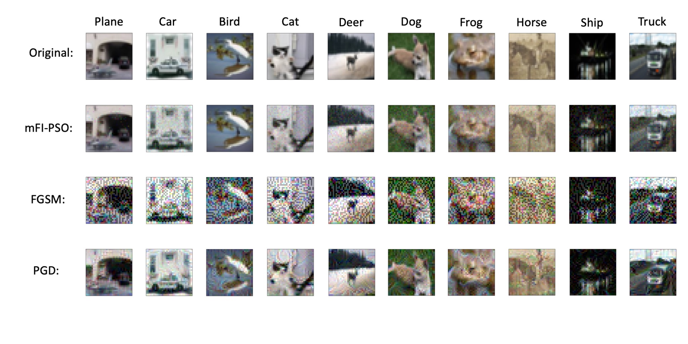

# mFI_PSO — Adversarial Image Generation and Training for Deep Neural Networks
This repo is the official implementation for [Adversarial Image Generation and Training for Deep Neural Networks](https://arxiv.org/pdf/2006.03243.pdf).

## Requirements
- keras 2.4.0
- tensorflow 2.3.0
- numpy 
- xlwt
- scipy
- xlrd
- seaborn
- natsort

## Instruction
Every executable file has a name that starts with a number, and this number also indicates the proper order to run the corresponding file starting from 0 to 10.
Please substitute '/your_path_to_main_dir/' to your actual path to the main directory in the executable files.

### Environment
Please prepare an environment with python=3.9, and then use the command "pip install -r requirements.txt" for the dependencies.

### Step 1:
Directory FI_Image_Choose:
`0.Cifar_set_make.py` / `0.Mnist_set_make.py`: download the datasets and properly preprocess them.
`1.Cifar_resnet32.py` / `1.Mnist_resnet32.py`: train ResNet32 with original training data.
`2.Cifar_pic_FI.py` / `2.Mnist_pic_FI.py`: Calculate pic_FI for every image in the datasets, and save them to an excel file.
`3.Cifar_and_Mnist_misjudgement_heatmap.py`: Determine y_target according to the misjudgement relationship.
`4.Cifar_adv_sample_choose.py` / `4.Mnist_adv_sample_choose.py`: Choose the qualified original image for making adversarial images.

### Step 2:
Directory Adv_Image_Generation:
`5.Cifar_adv_set_make_PSO.py` / `5.Mnist_adv_set_make_PSO.py`: use PSO to make adversarial images.
`6.make_adv_dataset_cifar.py` / `6.make_adv_dataset_mnist.py` : concatenate every adversarial image and target into one npy file.

### Step3:
Directory Sucess_Rate:
`7.success_rate_cifar.py` / `7.success_rate_mnist.py`: calculate the success rate of the generated adversarial images.

### Step4:
Directory Defense_Training:
`8.mix_original_adv_data_cifar.py` / `8.mix_original_adv_data_mnist.py`: mix the original training and testing data with adversarial training and testing images.
`9.defense_training_cifar.py` / `9.defense_training_mnist.py` : retrain the original trained model with the mix of original and adversarial images.

### Step5:
Directory Calculating_Actual_Perturbation:
`10.calculating_perturabtion_cifar.py` / `10.calculating_perturabtion_mnist.py`: calculate the actual max absolute difference summary statistics between the original image and adversarial images.

### Step6:
You may repeart Step 1 (2,3,4), Step 2, and Step 3 to reattack the defense trained network to see the improvement in the model robustness.

